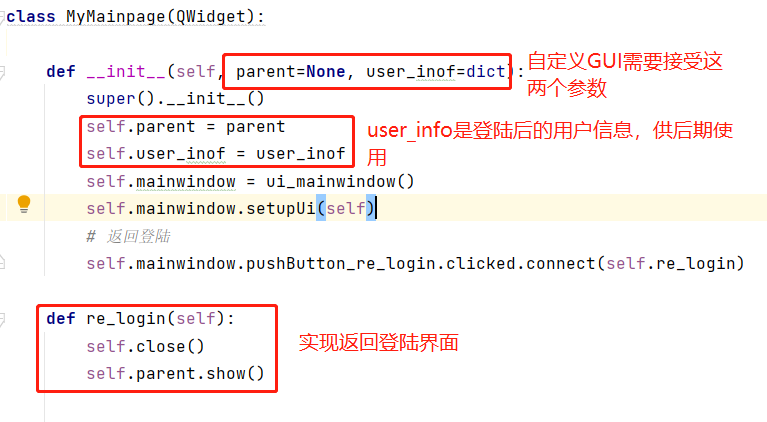

# 登陆系统 GUI PySide6 / PyQt6
# 

>请优先配置config.py
>
> 包含mysql、redis、邮箱


# Running
> pip install -r requirements.txt .
> 
>执行app/models/create_tables.py 创建数据库表
>


> ## **Windows**:
```console
python login_system.py
```
> ## **MacOS and Linux**:
```console
python3 login_system.py
```
# Compiling
> ## **Windows**:
```console
pyinstaller setup.spec 
更推荐：auto-py-to-exe 执行打包
```
# 项目目录
 PySide6_Login_System
>app：登录系统相关程序
> 
> ExcelMain_GUI：示范用例1
> 
> Image_GUI：示范用例2
> 
> Modern_GUI：示范用例3
> 
> cogfig.py：配置文件
> 
> login_system.py：启动入口
>

# Project Files And Folders

> **app/UI_all/***: Qt Designer UI 项目

> **app/handlers/***: 登陆、注册、修改密码逻辑代码


> **app/images/***: 登陆界面图像展示（图片，动态图，视频）,可自定义添加

> **app/models/***: SQLAlchemy创建表，执行GUI之前需要先执行表创建

> **app/utls/***: 邮箱验证、验证码获取、邮箱发送、密码hash、检查注册密码

> **login_system.py**: 程序入口文件

> **setup.spec**: pyinstaller setup.spec 进行打包，Windows
> 
# 配合自定义GUI使用
### 示例项目1
> **项目**:Modern_GUI 是PyDracula开源项目（默认)
>  
> **项目地址**：https://gitcode.com/Wanderson-Magalhaes/Modern_GUI_PyDracula_PySide6_or_PyQt6/overview

### 示例项目2
> **项目**:Image_GUI是随机图片展示
> 
> **使用方法**：修改login_system.py中的16\17\18行导入即可更换


### 示例项目3 （需要添加 pandas [pip install pandas]）
> **项目**:Excel_Main_GUI是excel、csv等文件合并
> 
> **使用方法**：修改login_system.py中的16\17\18行导入即可更换

### 自定义项目添加
>**使用方法**：将你的项目文件夹放入到同级目录中，在login_system.py中导入即可
> 
> **注意**：在你的主窗口中必须接收两个参数，一个是parent登陆GUI实列，另一个是user_info用户信息；且需要实现logout的按钮功能，否则自动登陆后无法使用其他用户登陆
>
> 下图演示的是需要实现的logout方法：
> 
> 